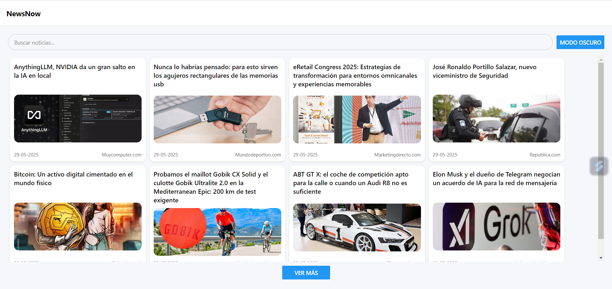
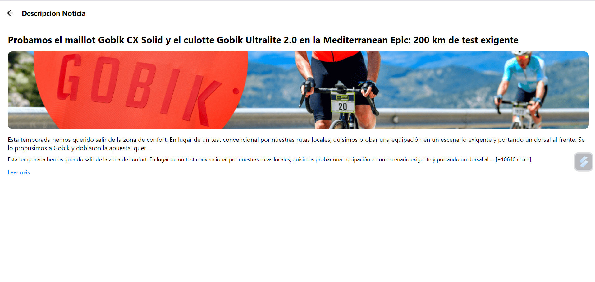

# 📰 Proyecto Final - NEWS NOW Aplicación de Noticias

Aplicación móvil desarrollada en React Native con Expo para consultar y explorar noticias actualizadas de distintas categorías y medios.

---

## ✨ Características principales

- 🗞️ Noticias destacadas 
  Accede a un listado de noticias relevantes y actualizadas.

- 🔍 Búsqueda en tiempo real  
  Encuentra rápidamente noticias por título o contenido.

- 🌐 Interfaz intuitiva  
  Navegación sencilla y fluida gracias a React Navigation.

- 📱 Responsive y adaptable  
  Se adapta a cualquier tamaño de pantalla y dispositivo móvil.

---

## 📸 Capturas de pantalla

Aquí algunas capturas del funcionamiento de la aplicación:

| Pantalla Principal                      | Descripcion de la Noticia                    |
| -------------------------------------- | ------------------------------------------ |
|  |  |

---

## 🚀 Instalación y ejecución

1️⃣ Clona el repositorio:

```bash
git clone https://github.com/Sebastian200512/proyecto-final
cd proyecto-final
2️⃣ Instala las dependencias:

bash
Copiar
Editar
npm install
3️⃣ Inicia la aplicación:

bash
Copiar
Editar
npx expo start
4️⃣ Escanea el QR con Expo Go o usa un emulador.

🗂️ Estructura del proyecto
bash
Copiar
Editar
/assets
/components
/navigation
/screens
App.js
package.json

🔧 Tecnologías y dependencias principales
React Native

Expo

React Navigation

Axios (para consumo de la API de noticias)

Expo Vector Icons

💡 Uso
📲 Noticias:
Visualiza las últimas noticias disponibles, filtradas y actualizadas.

🔍 Búsqueda:
Utiliza la barra de búsqueda para encontrar noticias específicas de manera instantánea.

👥 Autores
Daniel Colorado
Desarrollador Full Stack
GitHub https://github.com/felipeco18

Sebastián Patiño
Desarrollador Full Stack
GitHub https://github.com/Sebastian200512
